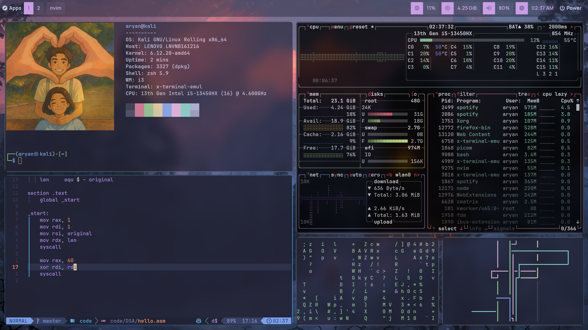
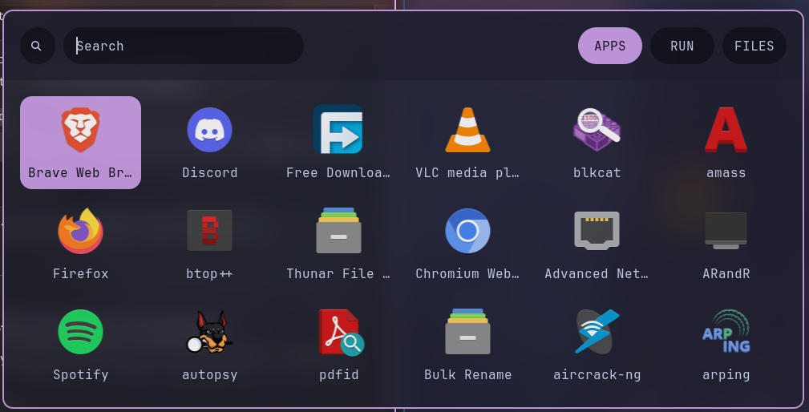
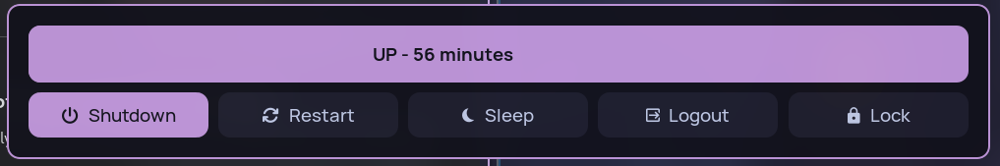

# 🌸 i3wm Dotfiles – Aesthetic + Functional Tiling Setup

Welcome to my personal i3wm dotfiles! This repo contains my fully themed and customized i3 window manager configuration, designed for a clean, minimal, and highly functional workflow — all wrapped in a gorgeous Catppuccin Mocha Rosewater-inspired theme.



## 📸 Additional Previews

**🌊 Dock Preview**  


**⚡ Power Menu**  


## ✨ Features

- 🚀 Lightweight and fast tiling window manager (i3-gaps)
- 🧠 Smooth and responsive keybindings for productivity
- 🎨 Beautiful Catppuccin Mocha Rosewater color scheme across all components
- 🔒 Sleek i3lock setup with blur + rounded corners
- 🎛 Custom Rofi menus: launcher, powermenu, wifi menu, askpass, confirm
- 🎵 Polybar with Spotify module, CPU/RAM, i3 workspaces, and more
- 📦 Minimal yet complete dotfiles for fast deployment
- 🖋 Fonts: `JetBrains Mono`, `Manrope`, `RecMonoCasual Nerd Font`

## 🧰 Tools Used

| Tool           | Purpose                        |
|----------------|--------------------------------|
| `i3-gaps`      | Tiling window manager          |
| `Polybar`      | Status bar                     |
| `Rofi`         | App launcher and menus         |
| `i3lock`       | Lock screen                    |
| `feh` / `nitrogen` | Wallpaper setting          |
| `picom`        | Compositor with blur & shadow  |
| `dunst`        | Notification daemon            |
| `alacritty` / `kitty` | Terminal emulator       |
| `playerctl`    | Media control for Polybar      |

## 🎨 Theming

Everything is themed using the **Catppuccin Mocha Rosewater** palette. This includes:

- Rofi menus (`launcher`, `powermenu`, `wifi.rasi`, etc.)
- Polybar modules
- i3 borders and gaps
- Lock screen
- Notifications

## 🔧 Installation

> ⚠️ This setup is tailored for **Kali Linux** with **i3wm**. Use at your own risk and back up existing configs!

```bash
git clone https://github.com/Dragonslayer-9095/I3wm.git ~/.dotfiles
cd ~/.dotfiles
```
Now use the files by moving them to the appropriate directories

## 🧠 What I Learned

Throughout this rice and dotfiles journey, I picked up a ton of valuable knowledge and skills:

| Concept / Tool         | What I Learned / Did                                                                 |
|------------------------|--------------------------------------------------------------------------------------|
| `i3wm` + `i3-gaps`     | Deep understanding of window manager configuration, workspace behavior, and keybinds |
| `Polybar`              | Creating and customizing modules, integrating system info and media controls         |
| `Rofi`                 | Building custom menus (power, wifi, launcher) with themes and interactivity          |
| `i3lock`               | Theming with blur, lock screen visuals, and systemd-based lock integration           |
| `Picom`                | Tweaking animations, shadows, blur, and opacity for a polished UX                   |
| `Dunst`                | Styling and positioning notifications with urgency levels                           |
| `Alacritty` / `Kitty`  | Minimal terminal configuration, font rendering, and transparency                    |
| `Playerctl`            | Media integration in Polybar                                                         |
| Git/GitHub             | Version-controlling dotfiles, branch management, handling merge conflicts           |
| Screenshot tools       | Using `flameshot`, binding screenshot keys, delay-based capture for popups          |
| Shell scripting        | Automating setup via `install.sh`, symlinking configs with checks                   |

> Bonus: Got much better at reading manpages and debugging system-level quirks (hello, `~/.config/i3/config` 😅)

---

